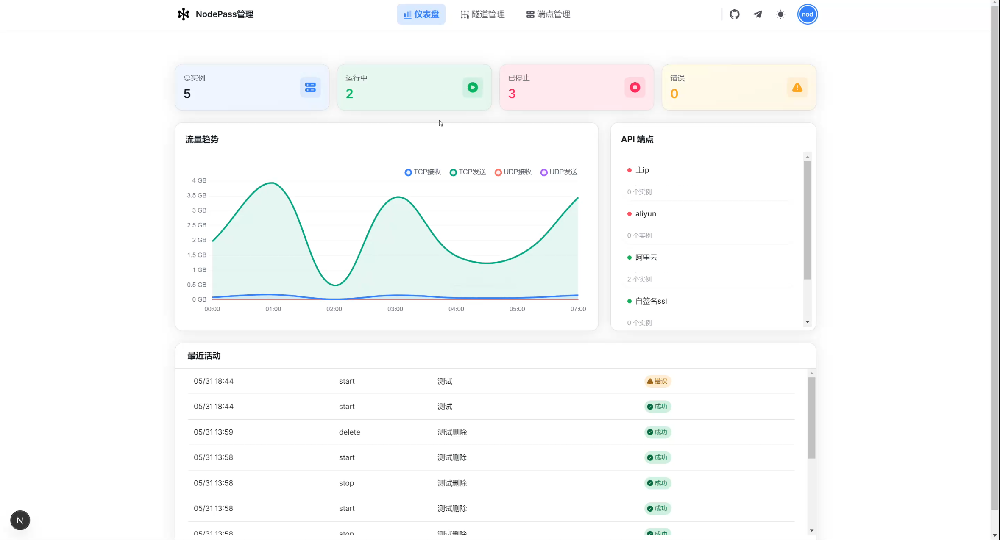
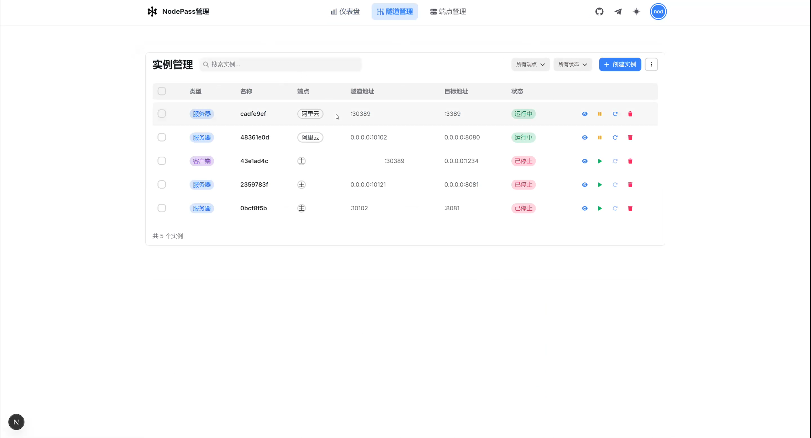
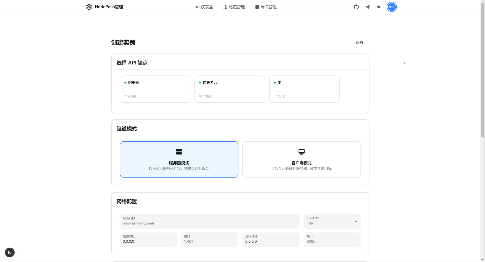

# 🚀 NodePassDash


NodePassDash是一个现代化的 NodePass 管理界面，基于 Next.js 14、HeroUI 和 TypeScript 构建。提供实时隧道监控、流量统计和端点管理功能。

## ✨ 主要特性

- 🎯 **实时监控**: 通过 Server-Sent Events (SSE) 实现实时隧道状态更新
- 📊 **流量统计**: 可视化显示隧道流量数据和性能指标
- 🎨 **现代UI**: 基于 HeroUI 的响应式设计，支持深色/浅色主题
- 📱 **移动适配**: 完整的移动端响应式布局，支持各种设备访问
- 🐳 **容器化**: 开箱即用的 Docker 部署方案
- 🔒 **SSL 自签名证书支持**：自动颁发自签名 SSL 用于加密

## 📸 界面预览

| | | |
|---|---|---|
|  |  |  |
|  |  |  |


## 🏗️ 技术栈

- **前端框架**: Next.js 14 (App Router)
- **UI 组件库**: HeroUI (NextUI v2)
- **样式框架**: Tailwind CSS
- **动画库**: Framer Motion
- **数据库**: SQLite + Prisma ORM
- **实时通信**: Server-Sent Events (SSE)
- **类型安全**: TypeScript + Zod 验证
- **包管理器**: pnpm

## 🚀 快速开始

>[>点此体验<](https://ihzdkxqijssj.us-east-1.clawcloudrun.com/) [nodepass/np123456]
> 
> ⚠️ **重要提醒：演示环境，请勿更改密码，请勿填写任何敏感信息**


### 方式一：Docker 部署（推荐）

我们提供了完整的 Docker 部署方案，支持：
- 🐳 预构建镜像快速部署
- 📦 本地构建部署
- 🔧 独立容器部署
- 🛡️ 生产环境部署

> ⚠️ **重要提醒：首次部署说明**
> 
> 系统首次部署时会自动初始化并创建管理员账户。请在部署后立即查看日志获取登录信息：
> ```bash
> # 如果使用 Docker Plugin
> docker compose logs
> # 或使用独立安装的 docker-compose
> docker-compose logs
> 
> # 你将看到如下信息：
> ================================
> 🚀 NodePass 系统初始化完成！
> ================================
> 管理员账户信息：
> 用户名: xxxxxxxx
> 密码: xxxxxxxxxx
> ================================
> ⚠️  请妥善保存这些信息！
> ================================
> ```

> 📚 查看 [Docker 完整部署文档](docs/DOCKER.md) 了解详细信息

### 方式二：本地开发

#### 前提条件

- Node.js 18+
- pnpm
- SQLite 数据库

#### 安装步骤

```bash
# 1. 克隆项目
git clone https://github.com/NodePassProject/NodePassDash.git
cd NodePassDash

# 2. 安装依赖
pnpm install

# 3. 配置环境变量
cp .env.example .env
# 编辑 .env 文件，设置数据库连接等配置

# 4. 初始化数据库
pnpm db:generate
pnpm db:migrate

# 5. 启动开发服务
pnpm dev
```

访问：
- 前端界面: http://localhost:3000

## 🛠️ 开发指南

### 项目结构

```
NodePassDash/
├── app/                   # Next.js App Router 页面
├── components/            # React 组件
├── lib/                   # 工具库和配置
├── prisma/                # 数据库模式和迁移
├── scripts/               # 构建和部署脚本
└── types/                 # TypeScript 类型定义
```

### 数据库配置

项目使用 SQLite 作为主数据库，通过 Prisma ORM 进行管理：

```bash
# 创建新迁移
pnpm exec prisma migrate dev --name your_migration_name
# 重置数据库
pnpm exec prisma migrate reset
# 查看数据库
pnpm exec prisma studio
```

## 🤝 贡献指南

欢迎贡献代码！请遵循以下步骤：

1. Fork 本仓库
2. 创建功能分支 (`git checkout -b features/amazing-features`)
3. 提交更改 (`git commit -m 'Add some amazing features'`)
4. 推送到分支 (`git push origin feature/samazing-features`)
5. 开启 Pull Request

## 📄 许可证

本项目基于 [BSD-3-Clause 许可证](LICENSE) 开源。

## 📞 支持

- 🐛 问题报告: [GitHub Issues](https://github.com/NodePassProject/NodePassDash/issues)
- 🐳 Docker 部署: [Docker 指南](docs/DOCKER.md)
- 💬 社区讨论: [Telegram 群组](https://t.me/NodePassGroup)
- 📢 频道: [Telegram 频道](https://t.me/NodePassChannel)

---

⭐ 如果这个项目对你有帮助，请给我们一个 Star！
